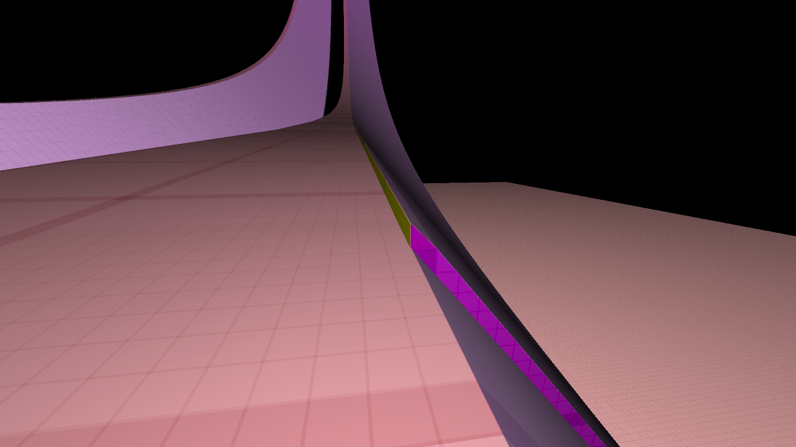
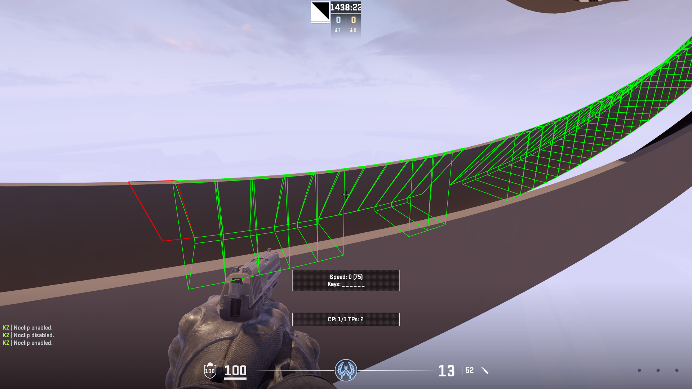
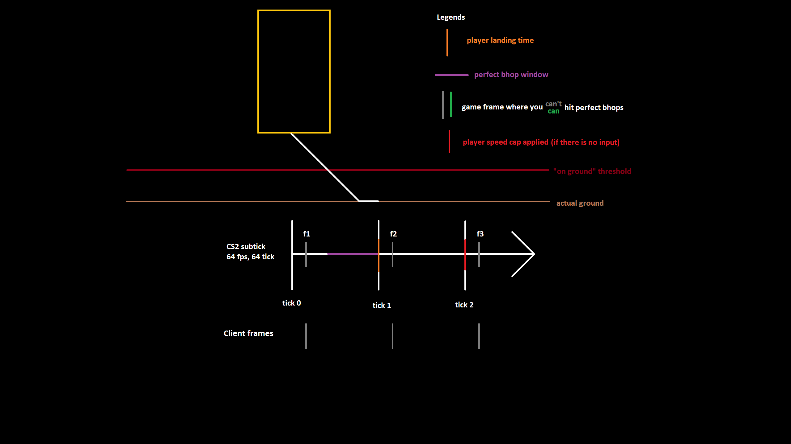

Below is the list of movement related issues related to CS2 which did not exist in CS:GO (except one).

This list will not cover *all* movement issues/bugs, and does not include multiplayer movement interactions.

Table of Contents:
- [Issues unrelated to subtick/tickrate](#issues-unrelated-to-subticktickrate)
	- [Rampbugs](#rampbugs)
		- [Hull rampbugs](#hull-rampbugs)
		- [Mesh rampbugs](#mesh-rampbugs)
	- [Ladder grabbing behavior is different](#ladder-grabbing-behavior-is-different)
	- [Standing on water floor prevents player from jumping](#standing-on-water-floor-prevents-player-from-jumping)
	- [Waterstrafe is no longer possible](#waterstrafe-is-no-longer-possible)
	- [exec\_async exploit (fixed 2025-09-10)](#exec_async-exploit-fixed-2025-09-10)
	- [yaw/pitch exploit](#yawpitch-exploit)
	- [Inability to be closer than 0.03125u towards any surface](#inability-to-be-closer-than-003125u-towards-any-surface)
	- [Deadstrafing (warning: not a CS:GO difference)](#deadstrafing-warning-not-a-csgo-difference)
- [Issues related to subtick or tickrate](#issues-related-to-subtick-or-tickrate)
	- [Airstrafe](#airstrafe)
	- [Bunnyhopping](#bunnyhopping)
		- [The jump cooldown](#the-jump-cooldown)
		- [The perf window](#the-perf-window)
	- [Ledgegrabs](#ledgegrabs)
	- [Crouchbug/Jumpbugs](#crouchbugjumpbugs)
	- [Jump height randomness](#jump-height-randomness)
	- [Subtick slideup](#subtick-slideup)
	- [Input automation](#input-automation)
	- [Slideup nerfs (2025-09-17 update)](#slideup-nerfs-2025-09-17-update)

# Issues unrelated to subtick/tickrate

## Rampbugs
Rampbugs describe the scenario where a player is sliding/surfing against some geometry but they suddenly lose all their momentum/velocity. While the name was inherited from Source 1 games (such as CS:GO, CS:S, TF2,...), rampbugs in CS2 behave much differently from its predecessor.

There are actually two types of rampbugs in CS2: one is mesh related and the other is hull related.

### Hull rampbugs
Hull rampbug is the older of the two, existing since the beginning of CS2 Limited Test. When an object is compiled using hull physics rather than the default mesh physics, the generated hulls might be invalid and will not be connected to each other, in some cases a hull could be one unit thicker.

(output of a custom raytracer showing normals of surfaces: https://codeberg.org/GameChaos/cs2raytrace/)

(problematic hull in red)

### Mesh rampbugs
Mesh rampbugs were introduced in 2023-06-20 update. Unlike hull rampbugs, mesh rampbugs are not caused by faulty physics generation, but they are rather caused by the changes during physics traces, causing the player to collide with the vertices that make up the mesh plane rather than the plane itself, despite the meshes' planes being connected to each other.

## Ladder grabbing behavior is different
Whether the player can grab a ladder in CS:GO depends on the player's view angles. In CS2, it does not seem to be the case anymore.

In CSGO, if the player looks straight down and walk forward towards a ladder, they will not grab it. Pressing S will then move the player backwards. In CS2, pressing S will result in the player moving up the ladder instead. This can be easily tested on any of de_nuke's ladder.

## Standing on water floor prevents player from jumping
If enough portion of the player is underwater and the player is standing on a floor, the player will not be able to jump, unlike CS:GO.

## Waterstrafe is no longer possible
Holding space while doing airstrafing movement when the player is on water will let the player accelerate to more than 200u/s (normal water speed) as they cycle between air movement and water movement. This is not possible in CS2, as the player do not pop up in the air at all. See [this video](https://youtu.be/j4eTynAWGjw?si=PzAcInhTVne9gmo1&t=55) for example of waterstrafing.

## exec_async exploit (fixed 2025-09-10)
`exec_async` executed before the player ever join any server will let players create async console calls whenever they want to and they will be queued across sessions despite `sv_cheats` being 0 on those sessions. This can be use to create desubticked inputs, as these commands are not bound to keys, and also "legit" movement recording scripts. See "ak47" directory for automated AK47 recoil mouse movement and "bhopping_scripts/exec_async" for perfect autobhop.

## yaw/pitch exploit
With a low enough polling rate, binding mouse_x/mouse_y can be used to run chains of aliases. This can be made into movement recording scripts as well. See bhopping_scripts/mouse_x for an example of perfect autobhop script using mouse movement.

## Inability to be closer than 0.03125u towards any surface
Note: This is a very niche movement technique and has no use in competitive play.

In CS:GO, players normally stop 0.03125u when they run towards a surface. They can "wiggle" next to them however, by holding w and moving mouse left and right, so they can accelerate in a way that put them closer to that surface without colliding with it. In CS2, this is not possible.

In CS:GO, players can use ladder, slopes, or a very precise chain of bunnyhops to position themselves between 0.03125 and 0.015625u above the ground. See [this video](https://www.youtube.com/watch?v=CZI0R-vPH88) as example to how this is used.

## Deadstrafing (warning: not a CS:GO difference)
This decribes a period in the air where the player has reduced airstrafing capacity. This behavior is present in all source 1/2 games (not in GoldSrc games like CS 1.6), but is not communicated to players in any way whatsoever.

Airstrafe takes surface friction into account. Inside `AirAccelerate`, the acceleration is multiplied by m_flSurfaceFriction value, even though the player is in the air and shouldn't have any "friction" with a surface. If the player has a vertical velocity between 0 and +140.0, its value changes to 0.25, effectively reducing the ability to airstrafe by 75%. This is most likely why players over the past 20 years have been complaining about how airstrafing is much worse than 1.6.

# Issues related to subtick or tickrate

## Airstrafe
First, airstrafe in CS2 does not match CS:GO 128 tick value. This is expected as air acceleration is mostly tick based, and the tickrate is still 64 in CS2, so the player just has fewer ticks to gain speed. This causes some jumps to be significantly harder as every flat ground jump is now up to 9 units shorter, which is significant.

Subtick also makes the player gain less speed overall, as they can overlap mid way through a tick (or release a key too early), which is not possible in CS2.

## Bunnyhopping
The introduction of the subtick system on movement forces player to be ridiculously, and sometimes impossibly more precise with their scroll timing compared to CS:GO, making bunny hopping even more inconsistent than it already was.

### The jump cooldown
As explained by Valve employee, McJohn in the reddit post about bhops:

https://www.reddit.com/r/GlobalOffensive/comments/14mlg5r/counterstrike_global_offensive_release_notes_for/jq6fjiv/

> in CS:GO, if you pressed the jump button on one tick the game would ignore it on the next tick--except to remember that you pressed it again. That's why sometimes when you use mousewheel to bunny hop, you'll not jump at all and instead will just land and strafe (try spinning the scroll wheel really fast).

He also went on and said this:

> The earliest in the tick that you could press the jump button was the first frame of that tick (and basically at the beginning of that frame.) The soonest you would be able to press the jump button again and the game would consider trying to jump was not in tick 1, but in tick 2, which is 2 * 1/128 ticks later, or 0.015625 seconds.

This 15.6ms period is the value of `sv_jump_spam_penalty_time`, a console variable which controls how long the player needs to wait before being able to press jump again.

However, there are a few problems with this logic, and there are issues in the implementation of this convar which makes it almost useless in CS2. 

- First, the 15.625ms cooldown mentioned here is only the worst case scenario. In the best case scenario, if we press the jump button on the last frame of the tick, then it will only take the player 7.8125ms until they can jump again. Assuming that it’s equally likely for someone to press the jump button at the start of the tick and at the end of the tick, the average cooldown for jumping on CSGO 128 tick should be 11.71875ms.

- Second, keep in mind that this 12ms value is only the average cooldown. If I make a graph showing the odds that the player can jump again based on the wait time, the behavior is vastly different. In CSGO, it is still possible that they can jump again after a 8ms delay, albeit unlikely, while waiting for 12ms will only give them a 50% chance that they can jump again, unlike CS2 with 0% until 15.625ms later.

Regarding the implementation, there are two key issues:

- With `sv_jump_spam_penalty_time` just ever so slightly smaller than 1/64th of a second, you can achieve 100% perf rate with desubticked jumps. The reason for that is that by having the `sv_jump_spam_penalty_time` under the tick interval, the player can use the desubtick jump to align their jump to the tick, ensuring that they are never too close to each other.

- There is also another bug (or feature) with subtick scroll inputs, which completely nullifies most of the functionality of the convar.

	- Scroll inputs are slightly different from normal keypresses. Inputs done by the scroll wheel are pressed then immediately released on the same frame. This is so that binding inputs to the scroll wheel will not make the player stuck holding the key if they happen to scroll for an odd number of steps, since there’s no such thing as “releasing the scroll button”. 

 	- However, the subtick system doesn’t like this at all. When the player scroll, it completely discards the releasing part of the scroll, and assumes that the jump button is kept pressed until the end of the entire tick. This effectively means the `sv_jump_spam_penalty_time` value of 15.625ms is actually in reality the **minimum** value, and the **real cooldown** is actually anywhere between *15.625* and *31.25* ms, depending on when during the tick they scroll. This also happens to be the real cooldown of 64 tick CSGO, and nothing actually changed for the average scroll bhop enthusiast.

However, the jump cooldown is only one half of the equation. The real reason concerns another aspect of bunny hopping that McJohn has yet to mention: 

### The perf window

The previous section only describes the cooldown between jumps. But there are actually two separate criteria that the player needs to meet in order to hit a perfect bunny hop:

- First, there needs to be no jump input made right before they land. This is the cooldown that McJohn was talking about.

- Second, there is a very short time window after landing where they need to send the jump input before the game runs the ground movement code (`WalkMove`) and slows them down.

If bhopping was only about the jump cooldown, the few experienced players who bunnyhop with spacebar would see no difference between 64 tick CSGO and CS2 since they do not have to worry about any sort of cooldown on their single keypress. 

But that is not the case.

The subtick system changes how often these simulations are executed. Every time a key is pressed or released, the tick simulation is split into two shorter simulations, the first one simulates the player movement before the keypress, and the second simulates the player movement after the keypress. 

More simulations means the ground speed check happens more often, resulting in having less or even no time at all to perform a perfect bunny hop. It can be literally impossible to hit any perfect bhop, if the client frames land on unfortunate times, see image below: 

## Ledgegrabs
Ledgegrab is when the player lands on the ground immediately despite the player still going up vertically. This happens when the player is less than 2u above any ground while having less than 140u/s vertical velocity.

The game being on 64 tick make this less likely to happen, however scrolling to generate multiple movement simulations will guarantee its success (if the player has enough fps). This is somewhat awkward and also makes "free wheel" mice pay2win as well, as they can much more generate subtick inputs when needed. See demonstration [here](https://youtu.be/tWNE78RYNj4?si=AgqUihtsvmH22m-h).

## Crouchbug/Jumpbugs
Crouchbugs are frame perfect unduck input (tick perfect in CS:GO) where the player land via unduck and take no fall damage or stamina loss as a result. This can only be performed when the player is 9 to 11 units above the ground. This is not always possible in CS:GO since it is possible that the player is never at the right vertical coordinates (more possible with higher tickrate), but it is always possible in CS2 (the higher the fps, the more possible it is), though inconsistently so.

Jumpbugs are crouchbugs but the player also has to perform a perfect bunny hop (send a jump input on the exact same frame) as well.

Since these have to be client frame perfect in CS2 which requires much more precision than tick perfect, they are incredibly more unreliable than CSGO.

## Jump height randomness
Jump height deviates more and more over time, making 66 units block jumps very unreliable (see de_ancient A site box). On community servers where maps can stay the same for hours/days, this issue is particularly noticeable.

## Subtick slideup
The player can surf up any surface faster if they bind jump to mouse wheel then spam the wheel as they slide up the surface. 

This is because it generates more subtick inputs, and the sum of distances moved by these subtick inputs are more than if they just hold W and do nothing. This means player with free wheel mouse will get an unfair advantage.

## Input automation
Snaptap/nulling/SOCD detection on A and D keys is the only input automation detection method around, but it can be easily bypassed by having an automation script that intentionally or unintentionally does not work some of the time.

The introduction of subtick has made a lot more of input automation scripts more appealing, such as:
- Crouch jump, automatically crouch and jump on the same client frame to crouch jump at maximum speed. This is arguably more impactful than Snap Tap/SOCD/nulling.
- Jumpbug, automatically press jump as crouch is released.
- W release, automatically releases W as jump is pressed.
- Instant strafe, automatically presses A/D as soon as jump is pressed.

These are all client frame perfect. This is not an issue in CS:GO, as `alias` these inputs were possible and allowed. In CS2, due to the block on multi-input binds, these are only accessible to people having certain keyboards, giving them unfair advantage.

## Slideup nerfs (2025-09-17 update)
2025-09-17 update "improved timestep-independence of subtick movement acceleration", which changed how acceleration is applied to movement. This change has indirectly nerfed surfing up slopes and ledges, as seen [here](https://youtu.be/uYUqn6psSw0).

Effective speed gain from sliding up is reduced. A steeper ramp could probably turn possible surfs to straight up impossible.

~~Surfing down seems mostly unaffected, suggesting that this is most likely related to [deadstrafes](#deadstrafing-warning-not-a-csgo-difference).~~

